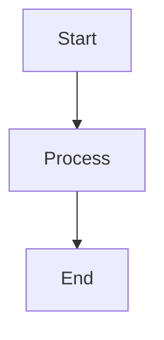

# MarkdownProcessor API

The `MarkdownProcessor` class transforms Obsidian-flavored markdown into HTML with support for wiki-links, math, diagrams, music notation, and more.

## Class: MarkdownProcessor

### Constructor

```typescript
class MarkdownProcessor {
  constructor()
}
```

**Note:** The constructor takes no parameters. Configuration is handled internally.

### Methods

#### initialize()

Initialize the markdown processor (must be called before processing).

```typescript
async initialize(): Promise<void>
```

This initializes the Shiki syntax highlighter. Call it once before processing any markdown.

**Example:**
```typescript
const processor = new MarkdownProcessor();
await processor.initialize();
```

#### processMarkdown()

Process markdown content and return a complete Note object.

```typescript
processMarkdown(
  filePath: string,
  content: string,
  vaultPath: string,
  allNotes?: Map<string, Note>
): Note
```

**Parameters:**
- `filePath`: Absolute path to the markdown file
- `content`: Raw markdown content
- `vaultPath`: Vault root path
- `allNotes`: (Optional) All notes for link resolution

**Returns:** A `Note` object with processed HTML

**Example:**
```typescript
const processor = new MarkdownProcessor();
await processor.initialize();

const content = await fs.readFile('./note.md', 'utf-8');
const note = processor.processMarkdown(
  './note.md',
  content,
  './vault',
  allNotes
);

console.log(note.title);
console.log(note.html);  // Processed HTML
```

#### generateBacklinks()

Generate backlinks for all notes.

```typescript
generateBacklinks(notes: Map<string, Note>): void
```

**Parameters:**
- `notes`: All notes in the vault

This method updates the `backlinks` array on each note based on which other notes link to it.

**Example:**
```typescript
const processor = new MarkdownProcessor();
processor.generateBacklinks(vaultData.notes);

// Now each note has populated backlinks
for (const note of vaultData.notes.values()) {
  console.log(`${note.title} has ${note.backlinks.length} backlinks`);
}
```

#### resolveEmbeddedNotes()

Resolve embedded note and base references.

```typescript
resolveEmbeddedNotes(
  html: string,
  allNotes: Map<string, Note>,
  bases?: Map<string, Base>
): string
```

**Parameters:**
- `html`: HTML with embed placeholders
- `allNotes`: All notes for embed resolution
- `bases`: (Optional) All bases for base embed resolution

**Returns:** HTML with embedded content

**Example:**
```typescript
const processor = new MarkdownProcessor();
const resolved = processor.resolveEmbeddedNotes(
  note.html,
  allNotes,
  bases
);
```

#### fixWikiLinks()

Fix wiki-link paths to use correct note IDs.

```typescript
fixWikiLinks(
  html: string,
  allNotes: Map<string, Note>
): string
```

**Parameters:**
- `html`: HTML with internal links
- `allNotes`: All notes for link resolution

**Returns:** HTML with corrected link paths

**Example:**
```typescript
const processor = new MarkdownProcessor();
const fixed = processor.fixWikiLinks(note.html, allNotes);
```

#### generateNoteId()

Generate a unique note ID from a path or link text.

```typescript
generateNoteId(linkText: string): string
```

**Parameters:**
- `linkText`: Note path or link text

**Returns:** URL-safe note ID

**Example:**
```typescript
const processor = new MarkdownProcessor();
const id = processor.generateNoteId('My Note');
// Returns: "my-note"

const id2 = processor.generateNoteId('folder/Sub Note');
// Returns: "folder/sub-note"
```

#### generateFrontMatterHtml()

Generate HTML for frontmatter properties display.

```typescript
generateFrontMatterHtml(frontMatter: FrontMatter): string
```

**Parameters:**
- `frontMatter`: Parsed frontmatter object

**Returns:** HTML for properties panel

**Example:**
```typescript
const processor = new MarkdownProcessor();
const html = processor.generateFrontMatterHtml({
  title: 'My Note',
  tags: ['documentation', 'api'],
  date: '2025-10-24'
});
```

## Supported Features

### Wiki-Links

Automatically converts Obsidian wiki-links to HTML:

```markdown
[[Note Name]]                 → <a href="/note-name">Note Name</a>
[[Note|Display]]             → <a href="/note">Display</a>
[[folder/Note]]              → <a href="/folder/note">Note</a>
[[Note#Heading]]             → Link to heading (not yet implemented)
```

### Embeds

Embeds notes and images:

```markdown
![[image.png]]               →  tag
![[Note]]                    → Embedded note content
![[Note|Title]]              → Embedded with custom title
![[Base.base]]               → Embedded database
![[Base.base#View]]          → Embedded with specific view
```

### Math Rendering (KaTeX)

Inline math: `$E = mc^2$`

Display math:
```markdown
$$
\int_{-\infty}^{\infty} e^{-x^2} dx = \sqrt{\pi}
$$
```

### Code Highlighting (Shiki)

Dual-theme syntax highlighting with light and dark variants:

````markdown
```typescript
const hello = (name: string) => {
  console.log(`Hello, ${name}!`);
};
```
````

Supported languages: TypeScript, JavaScript, Python, Java, C++, C, HTML, CSS, JSON, YAML, Bash, SQL, and many more.

### Mermaid Diagrams

Processed by MermaidProcessor:

````markdown

````

### ABC Music Notation

Processed by AbcProcessor:

````markdown
```abc
X:1
T:C Major Scale
M:4/4
K:C
CDEFGAB
```
````

### Callouts

Obsidian-style callouts:

```markdown
> [!note]
> This is a note

> [!warning]
> This is a warning

> [!tip] Custom Title
> This is a tip
```

Supported types: `note`, `tip`, `warning`, `important`, `info`

### Inline Base Syntax

Embed databases inline:

````markdown
```base
title: Tasks
filters:
  file.tag: task
views:
  - type: cards
    name: Card View
```
````

## Type Definitions

### ProcessContext

```typescript
interface ProcessContext {
  noteId: string;                 // Current note being processed
  notePath: string;               // Path to current note
  notes: Map<string, Note>;       // All vault notes
  attachments?: Map<string, string>; // Attachment paths
}
```

### HighlightConfig

```typescript
interface HighlightConfig {
  theme: 'dark' | 'light';
  languages: string[];            // Languages to support
  showLineNumbers?: boolean;
}
```

## Usage Examples

### Basic Processing

```typescript
import { MarkdownProcessor } from './markdown-processor';
import fs from 'fs';

const processor = new MarkdownProcessor();
await processor.initialize();

const content = fs.readFileSync('./note.md', 'utf-8');
const note = processor.processMarkdown(
  './note.md',
  content,
  './vault'
);

console.log(note.title);
console.log(note.html);
console.log(note.links);  // Extracted wiki-links
```

### With Full Vault Context

```typescript
const processor = new MarkdownProcessor();
await processor.initialize();

// Process all notes first
const notes = new Map();
for (const file of markdownFiles) {
  const content = fs.readFileSync(file, 'utf-8');
  const note = processor.processMarkdown(file, content, vaultPath);
  notes.set(note.id, note);
}

// Generate backlinks
processor.generateBacklinks(notes);

// Resolve embeds and fix links
for (const note of notes.values()) {
  note.html = processor.resolveEmbeddedNotes(note.html, notes);
  note.html = processor.fixWikiLinks(note.html, notes);
}
```

### Custom Frontmatter Rendering

```typescript
const processor = new MarkdownProcessor();

const frontMatter = {
  title: 'My Note',
  tags: ['documentation', 'api'],
  author: 'John Doe',
  date: '2025-10-24'
};

const html = processor.generateFrontMatterHtml(frontMatter);
// Generates collapsible properties panel
```

### Extract Links

```typescript
const processor = new MarkdownProcessor();
const content = `
# My Note

See [[Other Note]] and [[folder/Another Note|link text]].
Also check [[Third Note]].
`;

const note = processor.processMarkdown('./note.md', content, './vault');
console.log(note.links);
// ['Other Note', 'folder/Another Note', 'Third Note']
```

## Internal Processing

The markdown processor handles several stages internally:

1. **Frontmatter Extraction** - Uses `gray-matter` to extract YAML frontmatter
2. **Math Preservation** - Replaces math expressions with placeholders before markdown processing
3. **Obsidian Syntax** - Converts wiki-links and embeds to placeholders
4. **Markdown to HTML** - Uses `marked` library with custom renderer
5. **Code Highlighting** - Shiki generates dual-theme HTML (light/dark)
6. **Special Blocks** - ABC and Mermaid blocks are wrapped for client-side rendering
7. **Math Restoration** - Renders math with KaTeX and restores in output
8. **Frontmatter HTML** - Generates collapsible properties panel

## Performance Notes

- **Shiki Initialization**: Takes ~1-2 seconds on first call, then cached
- **Math Rendering**: KaTeX is fast, inline math < 1ms, display math < 5ms
- **Link Resolution**: O(n) where n is number of wiki-links in note
- **Embed Resolution**: Done in second pass after all notes processed

## Related Processors

- **AbcProcessor** (`src/abc-processor.ts`) - Handles ABC music notation
- **MermaidProcessor** (`src/mermaid-processor.ts`) - Handles Mermaid diagrams
- **BaseProcessor** (`src/base-processor.ts`) - Handles .base database files

---

See also: [[VaultProcessor API]] • [[BaseProcessor API]] • [[SiteGenerator API]] • [[../Features/Syntax Reference|Syntax Reference]]
