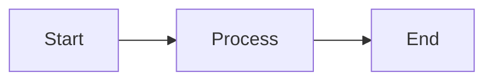

# MarkdownProcessor API

The `MarkdownProcessor` class transforms Obsidian-flavored markdown into HTML.

## Class: MarkdownProcessor

### Constructor

```typescript
class MarkdownProcessor {
  constructor(config: MarkdownConfig)
}
```

### Methods

#### process()

Process markdown content to HTML.

```typescript
process(
  content: string,
  context: ProcessContext
): string
```

**Parameters:**
- `content`: Raw markdown string
- `context`: Processing context (current note info, vault data)

**Returns:** Processed HTML string

**Example:**
```typescript
const processor = new MarkdownProcessor({
  highlightCode: true,
  processMermaid: true,
  processABC: true
});

const html = processor.process(markdownContent, {
  noteId: 'MyNote',
  notes: vaultData.notes
});
```

#### processWikiLinks()

Convert wiki-links to HTML links.

```typescript
processWikiLinks(
  content: string,
  notes: Map<string, Note>
): string
```

**Syntax Support:**
```markdown
`[[Note]]`                    → Link to note
`[[Note|Display Text]]`       → Link with custom text
`[[Note#Heading]]`            → Link to heading
`[[Note#Heading|Text]]`       → Link to heading with text
`![[Image.png]]`              → Embed image
`![[Note]]`                   → Embed note content
```

**Example:**
```typescript
const processed = processor.processWikiLinks(
  'See `[[Other Note]]` for details',
  notes
```

**Example:**
```typescript
const processed = processor.processWikiLinks(
  'See [[Other Note]] for details',
  notes
);
// Result: 'See <a href="/Other-Note">Other Note</a> for details'
```

#### processCodeBlocks()

Process code blocks with syntax highlighting.

```typescript
processCodeBlocks(
  content: string,
  highlighter: Highlighter
): string
```

**Supported Languages:**
```markdown
```typescript
// TypeScript code
const x: number = 42;
```

```python
# Python code
def hello():
    print("Hello")
```

```json
{
  "key": "value"
}
```
```

#### processMermaid()

Process Mermaid diagram blocks.

```typescript
processMermaid(content: string): string
```

**Example Input:**
```markdown

```

**Output:**
```html
<div class="mermaid">
graph LR
    A[Start] --> B[Process]
    B --> C[End]
</div>
```

#### processABC()

Process ABC music notation blocks.

```typescript
processABC(content: string): string
```

**Example Input:**
```markdown
```abc
X:1
T:Scale
M:4/4
L:1/4
K:C
CDEFGAB
```
```

**Output:**
```html
<div class="abc-notation">
X:1
T:Scale
M:4/4
L:1/4
K:C
CDEFGAB
</div>
```

#### processCallouts()

Process Obsidian-style callouts.

```typescript
processCallouts(content: string): string
```

**Syntax:**
```markdown
> [!note]
> This is a note callout

> [!warning]
> This is a warning

> [!info] Custom Title
> With custom title
```

**Supported Types:**
- `note` - Information callout
- `warning` - Warning callout
- `tip` - Tip/advice callout
- `important` - Important callout
- `caution` - Caution callout

#### processTags()

Extract and process tags.

```typescript
processTags(content: string): {
  content: string;
  tags: string[];
}
```

**Syntax Support:**
```markdown
#tag                    → Inline tag
#nested/tag             → Nested tag
Tags: #tag1, #tag2      → Multiple tags
```

**Example:**
```typescript
const result = processor.processTags('Content with #tag1 and #tag2');
console.log(result.tags); // ['tag1', 'tag2']
```

## Configuration

```typescript
interface MarkdownConfig {
  highlightCode?: boolean;        // Enable syntax highlighting
  processMermaid?: boolean;       // Process Mermaid diagrams
  processABC?: boolean;           // Process ABC notation
  processCallouts?: boolean;      // Process callouts
  allowHTML?: boolean;            // Allow raw HTML in markdown
  sanitizeHTML?: boolean;         // Sanitize HTML output
  baseUrl?: string;               // Base URL for links
}
```

## Type Definitions

### ProcessContext

```typescript
interface ProcessContext {
  noteId: string;                 // Current note being processed
  notePath: string;               // Path to current note
  notes: Map<string, Note>;       // All vault notes
  attachments?: Map<string, string>; // Attachment paths
}
```

### HighlightConfig

```typescript
interface HighlightConfig {
  theme: 'dark' | 'light';
  languages: string[];            // Languages to support
  showLineNumbers?: boolean;
}
```

## Usage Examples

### Basic Markdown Processing

```typescript
import { MarkdownProcessor } from './markdown-processor';

const processor = new MarkdownProcessor({
  highlightCode: true,
  processMermaid: true,
  processABC: true,
  processCallouts: true
});

const markdown = `
# My Note

This links to [[Other Note]].

\`\`\`typescript
const x: number = 42;
\`\`\`

> [!note]
> Important information
`;

const html = processor.process(markdown, {
  noteId: 'MyNote',
  notePath: 'folder/MyNote.md',
  notes: vaultData.notes
});
```

### Custom Link Processing

```typescript
// Override wiki-link processing
processor.processWikiLinks = (content, notes) => {
  return content.replace(/\[\[([^\]]+)\]\]/g, (match, link) => {
    const [target, display] = link.split('|');
    const note = notes.get(target.trim());
    
    if (!note) {
      return `<span class="broken-link">${display || target}</span>`;
    }
    
    return `<a href="/${note.id}" class="wiki-link">${display || note.title}</a>`;
  });
};
```

### Extract Frontmatter

```typescript
const markdown = `---
title: My Note
tags: [concept, important]
date: 2025-01-01
---

# Content here
`;

const frontmatterRegex = /^---\n([\s\S]*?)\n---/;
const match = markdown.match(frontmatterRegex);

if (match) {
  const frontmatter = yaml.parse(match[1]);
  const content = markdown.slice(match[0].length);
  
  console.log(frontmatter.title); // "My Note"
  console.log(frontmatter.tags);  // ["concept", "important"]
}
```

### Process Embeds

```typescript
// Embed another note's content
const embedRegex = /!\[\[([^\]]+)\]\]/g;
const processedContent = markdown.replace(embedRegex, (match, noteId) => {
  const embeddedNote = notes.get(noteId);
  if (!embeddedNote) return match;
  
  return `<div class="embedded-note">
    <h3>${embeddedNote.title}</h3>
    ${processor.process(embeddedNote.content, context)}
  </div>`;
});
```

### Custom Syntax Extensions

```typescript
// Add custom syntax processing
processor.addCustomProcessor((content: string) => {
  // Process custom [[todo]] syntax
  return content.replace(/\[\[todo\]\]/g, 
    '<input type="checkbox" class="task-checkbox">');
});
```

---

Read Next: [[GraphRenderer API]] > [[SiteGenerator API]] > [[../Architecture/Core Components|Core Components]]
