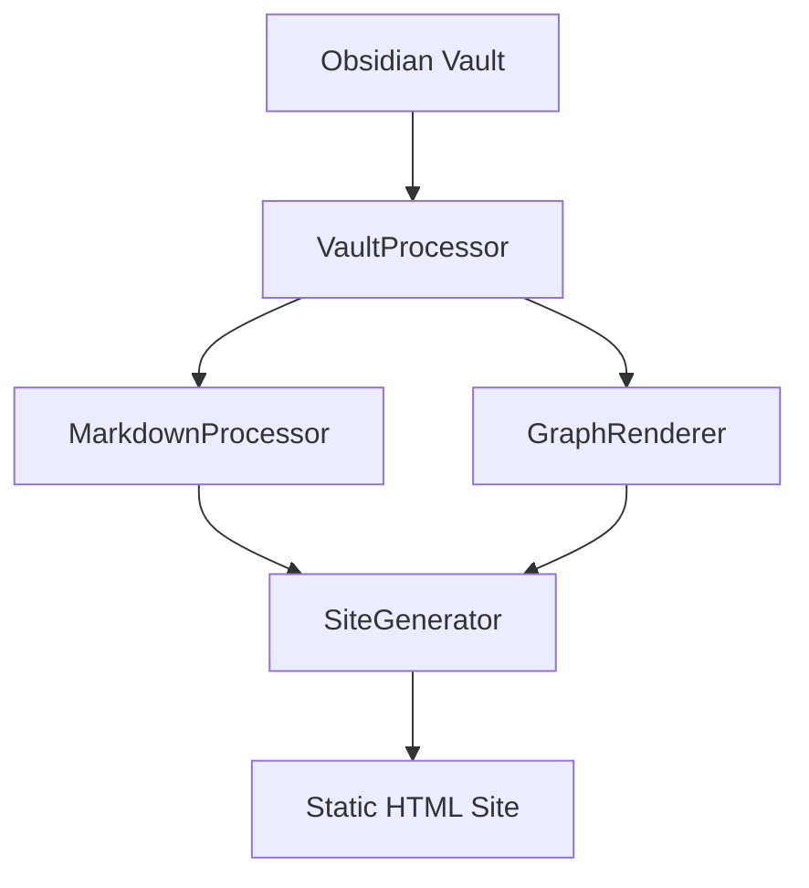

# Core Components

ObsidianP consists of several core components that work together to transform your vault into a static website.

## Architecture Overview



## Component Relationships

The system follows a pipeline architecture:

1. **[[VaultProcessor API|VaultProcessor]]** - Reads vault structure
2. **[[MarkdownProcessor API|MarkdownProcessor]]** - Transforms content
3. **[[GraphRenderer API|GraphRenderer]]** - Creates visualizations
4. **[[SiteGenerator API|SiteGenerator]]** - Generates final site

## VaultProcessor

**Purpose:** Read and parse Obsidian vault structure

**Key Responsibilities:**
- Scan directory structure
- Read markdown files
- Extract frontmatter
- Build link graph
- Identify tags and categories

**Output:**
```typescript
{
  notes: Map<string, Note>,
  folders: FolderStructure[],
  tags: Map<string, string[]>,
  linkGraph: LinkGraph
}
```

See [[../API-Reference/VaultProcessor API|VaultProcessor API]] for detailed API documentation.

## MarkdownProcessor

**Purpose:** Transform Obsidian markdown to HTML

**Key Responsibilities:**
- Convert wiki-links to HTML links
- Process embeds
- Syntax highlight code blocks
- Render Mermaid diagrams
- Render ABC notation
- Process callouts

**Input:** Raw markdown string
**Output:** Processed HTML string

See [[../API-Reference/MarkdownProcessor API|MarkdownProcessor API]] for detailed API documentation.

## GraphRenderer

**Purpose:** Create interactive graph visualizations

**Key Responsibilities:**
- Compute graph layouts using D3.js
- Render local graphs (note-centered)
- Render global graphs (all notes)
- Render mini graphs (sidebar)
- Handle user interactions

**Technologies:**
- D3.js for force-directed layout
- SVG for rendering
- Web Workers for large graphs (optional)

See [[../API-Reference/GraphRenderer API|GraphRenderer API]] for detailed API documentation.

## SiteGenerator

**Purpose:** Generate the final static website

**Key Responsibilities:**
- Generate HTML pages for each note
- Create index and navigation
- Copy assets (CSS, JS, images)
- Generate search index
- Create sitemap

**Output:** Static HTML site in `outputPath`

See [[../API-Reference/SiteGenerator API|SiteGenerator API]] for detailed API documentation.

## Supporting Components

### BaseProcessor

Base class for specialized processors:

```typescript
abstract class BaseProcessor {
  abstract process(input: any): any;
  protected config: ProcessorConfig;
}
```

Extended by:
- `MarkdownProcessor`
- `MermaidProcessor`
- `ABCProcessor`

### Templates

HTML templates for generated pages:

```typescript
interface Templates {
  noteTemplate: (data: NoteData) => string;
  indexTemplate: (data: IndexData) => string;
  graphTemplate: () => string;
}
```

### Search System

Client-side search functionality:

```typescript
class SearchEngine {
  buildIndex(notes: Note[]): SearchIndex;
  search(query: string): SearchResult[];
}
```

## Data Flow

### 1. Vault Reading Phase

```typescript
const processor = new VaultProcessor(vaultPath, config);
const vaultData = await processor.processVault();
```

### 2. Content Processing Phase

```typescript
const markdownProcessor = new MarkdownProcessor(config);
for (const [id, note] of vaultData.notes) {
  note.htmlContent = markdownProcessor.process(note.content, {
    noteId: id,
    notes: vaultData.notes
  });
}
```

### 3. Graph Generation Phase

```typescript
const graphRenderer = new GraphRenderer(
  container,
  vaultData.notes,
  vaultData.linkGraph
);
```

### 4. Site Generation Phase

```typescript
const generator = new SiteGenerator(config, templates);
await generator.generate(vaultData);
```

## File Structure

```
src/
├── vault-processor.ts      # Vault reading
├── markdown-processor.ts   # Markdown transformation
├── site-generator.ts       # HTML generation
├── templates.ts            # HTML templates
├── types.ts                # TypeScript types
└── assets/
    ├── graph.js            # Graph rendering
    ├── search.js           # Search functionality
    └── main.css            # Styling
```

## Extension Points

### Custom Processors

Add custom markdown syntax:

```typescript
class CustomProcessor extends BaseProcessor {
  process(content: string): string {
    // Custom processing logic
    return processedContent;
  }
}
```

### Custom Templates

Override default templates:

```typescript
const customTemplates = {
  noteTemplate: (data) => `
    <article>
      <h1>${data.title}</h1>
      ${data.content}
    </article>
  `
};
```

### Custom Graph Layouts

Implement alternative layout algorithms:

```typescript
class CustomGraphLayout {
  compute(nodes, links): Layout {
    // Custom layout algorithm
    return layout;
  }
}
```

## Performance Considerations

### Large Vaults (1000+ Notes)

- Use streaming processing
- Implement caching
- Progressive graph rendering
- Web Workers for computation

### Memory Management

```typescript
// Process in batches
const BATCH_SIZE = 100;
for (let i = 0; i < notes.length; i += BATCH_SIZE) {
  const batch = notes.slice(i, i + BATCH_SIZE);
  await processBatch(batch);
}
```

### Build Optimization

```typescript
// Watch mode with incremental builds
const watcher = watch('./vault/**/*.md');
watcher.on('change', async (path) => {
  await processChangedFile(path);
  await regeneratePage(path);
});
```

---

Read Next: [[../Features/Interactive Graph Views|Interactive Graph Views]]
