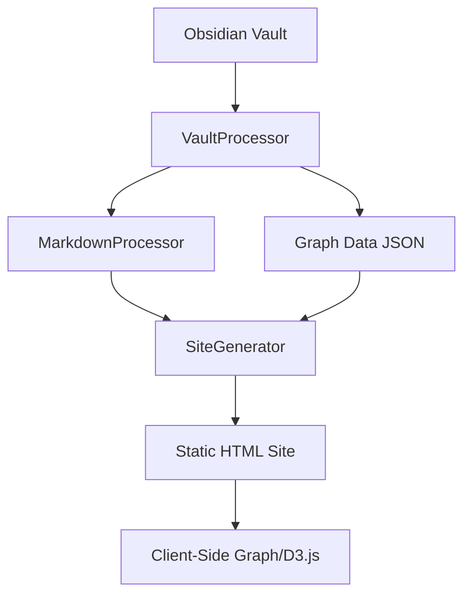

# Core Components

Obsidian:P consists of several core components that work together to transform your vault into a static website.

## Architecture Overview



## Component Relationships

The system follows a pipeline architecture:

1. **[[../API-Reference/VaultProcessor API|VaultProcessor]]** - Reads vault structure
2. **[[../API-Reference/MarkdownProcessor API|MarkdownProcessor]]** - Transforms content
3. **Client-Side Graph** - Creates visualizations (D3.js in browser)
4. **[[../API-Reference/SiteGenerator API|SiteGenerator]]** - Generates final site

## VaultProcessor

**Purpose:** Read and parse Obsidian vault structure

**Key Responsibilities:**
- Scan directory structure
- Read markdown files and `.base` database files
- Extract frontmatter
- Build link graph
- Identify tags and categories

**Output:**
```typescript
interface VaultStructure {
  notes: Map<string, Note>,
  bases: Map<string, Base>,
  folders: FolderNode[],
  tags: Map<string, string[]>,
  linkGraph: Map<string, Set<string>>
}
```

See [[../API-Reference/VaultProcessor API|VaultProcessor API]] for detailed API documentation.

## MarkdownProcessor

**Purpose:** Transform Obsidian markdown to HTML

**Key Responsibilities:**
- Convert wiki-links to HTML links
- Process embeds
- Syntax highlight code blocks with Shiki (dual theme)
- Render Mermaid diagrams
- Render ABC music notation
- Process callouts
- Render math with KaTeX

**Input:** Raw markdown string
**Output:** Processed HTML string

See [[../API-Reference/MarkdownProcessor API|MarkdownProcessor API]] for detailed API documentation.

## Client-Side Graph Visualization

**Purpose:** Create interactive graph visualizations in the browser

**Key Responsibilities:**
- Render local graphs (note-centered)
- Render global graphs (all notes)
- Render mini graphs (sidebar)
- Handle user interactions
- Compute force-directed layouts

**Technologies:**
- D3.js for force-directed layout
- SVG for rendering
- Client-side JavaScript in `src/assets/graph.js`

**Note:** Graph rendering is entirely client-side. The server generates JSON data that the browser uses to create visualizations.

## SiteGenerator

**Purpose:** Generate the final static website

**Key Responsibilities:**
- Orchestrate the entire build process
- Process vault with VaultProcessor
- Generate HTML pages for each note and base
- Copy assets (CSS, JS, images, fonts)
- Generate search index JSON
- Apply configuration and customization

**Output:** Static HTML site in `outputPath`

See [[../API-Reference/SiteGenerator API|SiteGenerator API]] for detailed API documentation.

## Supporting Components

### BaseProcessor

Processes `.base` database files:

```typescript
class BaseProcessor {
  processBase(filePath, content, vaultPath): Base;
  filterNotes(base, allNotes): Note[];
  processFormulas(base, notes): Note[];
  sortNotes(notes, view): Note[];
}
```

See [[../API-Reference/BaseProcessor API|BaseProcessor API]] for detailed documentation.

### Templates

HTML template functions for generated pages:

```typescript
// In src/templates.ts
function generateMainTemplate(title, basePath): string;
function generateNoteTemplate(title, content, frontMatter, backlinks, basePath): string;
function generateNoteHTML(content, vaultTitle, basePath, noteTitle): string;
function generateBaseHTML(base, vaultTitle, basePath, processor): string;
```

### Client-Side Components

Located in `src/assets/`:

- **graph.js** - D3.js-based graph visualization
- **search.js** - Client-side search functionality
- **table-of-contents.js** - Dynamic TOC generation
- **main.js** - General UI interactions and theme switching

## Data Flow

### 1. Vault Reading Phase

```typescript
const processor = new VaultProcessor(vaultPath, config);
const vaultData = await processor.processVault();
```

### 2. Content Processing Phase

```typescript
// Handled internally by VaultProcessor
const vaultData = await processor.processVault(vaultPath);
// Note: MarkdownProcessor is used internally
// All notes come back with processed HTML
```

### 3. Site Generation Phase

```typescript
const generator = new SiteGenerator();
await generator.generateSite(vaultPath, outputPath, config);
// This internally:
// - Processes vault
// - Generates HTML for all notes and bases
// - Copies assets
// - Creates data files
```

## File Structure

```
src/
├── cli.ts                  # Command-line interface
├── vault-processor.ts      # Vault reading and processing
├── markdown-processor.ts   # Markdown transformation
├── base-processor.ts       # Database file processing
├── site-generator.ts       # HTML generation and orchestration
├── templates.ts            # HTML template functions
├── types.ts                # TypeScript type definitions
├── abc-processor.ts        # ABC music notation
├── mermaid-processor.ts    # Mermaid diagrams
├── card-renderer.ts        # Card view rendering
├── note-highlighter.ts     # Note highlighting
└── assets/
    ├── graph.js            # Graph visualization (client-side)
    ├── search.js           # Search functionality (client-side)
    ├── table-of-contents.js  # TOC generation (client-side)
    ├── main.js             # Main client logic
    ├── main.css            # Styling
    └── abcjs-basic-min.js  # ABC notation library
```

## Extension Points

### Custom Markdown Processing

The MarkdownProcessor can be extended by modifying its behavior:

```typescript
// Customize code block rendering via marked renderer
// Customize link resolution logic
// Add custom syntax patterns
```

### Custom Base Views

Implement custom view types for `.base` database files by extending BaseProcessor filtering and rendering logic.

### Custom Templates

Override HTML generation in `src/templates.ts`:

```typescript
export function generateNoteTemplate(
  title: string,
  content: string,
  frontMatter: string,
  backlinks: string[],
  basePath: string
): string {
  // Custom HTML structure
  return `<article>...</article>`;
}
```

## Performance Considerations

### Large Vaults (1000+ Notes)

- Vault processing is sequential but uses async I/O
- Markdown processor initializes Shiki once and caches
- Graph rendering is client-side (browser handles layout computation)
- JSON data files enable fast client-side features

### Memory Management

The SiteGenerator processes notes sequentially to manage memory:

```typescript
// Process each note individually
for (const note of notes.values()) {
  const noteHtml = generateNoteHTML(note, config);
  await fs.writeFile(outputPath, noteHtml);
}
```

### Build Optimization

Use the `serve` command for development:
- Automatic rebuilding on file changes
- Incremental updates (detects changed files)
- Fast feedback loop

---

Read Next: [[../Features/Interactive Graph Views|Interactive Graph Views]]
