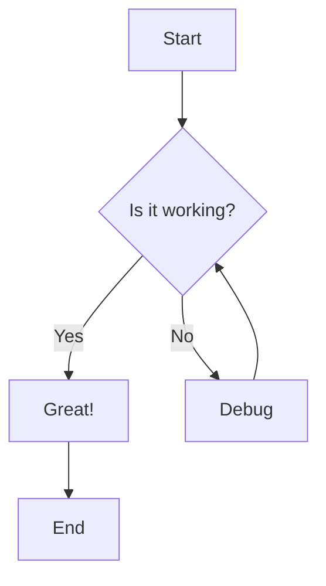
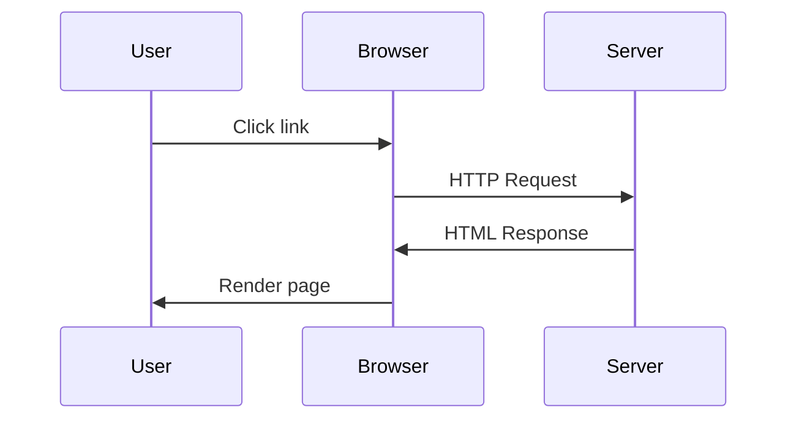
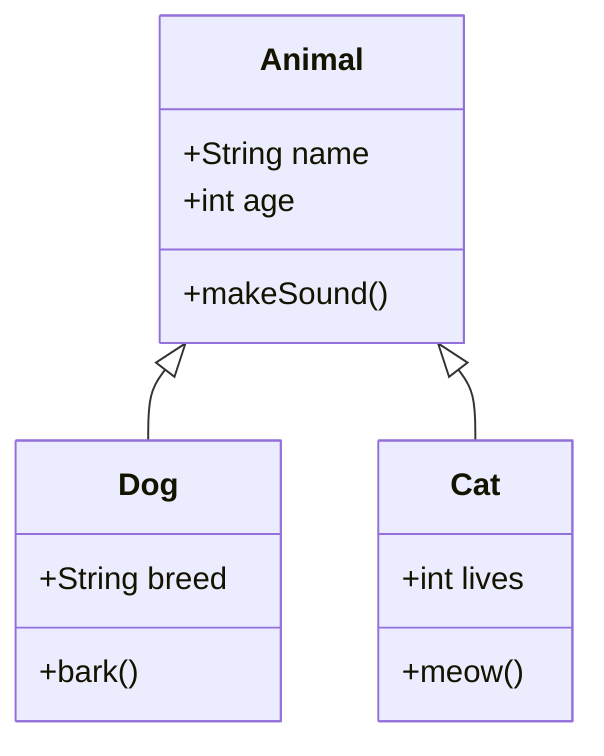
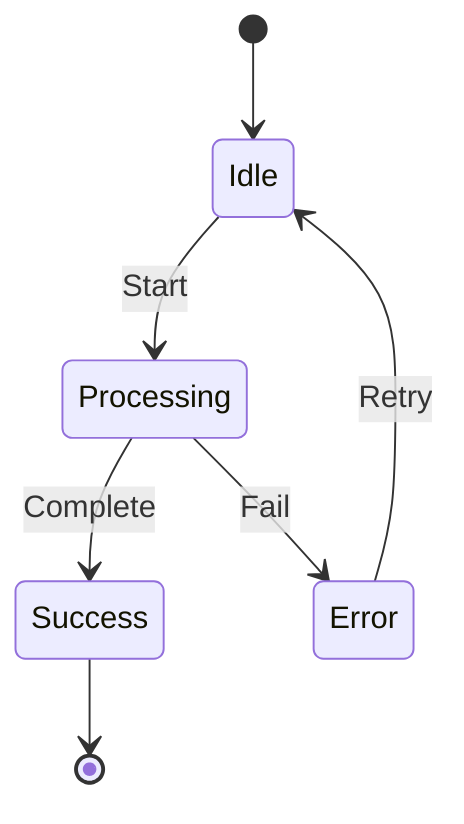
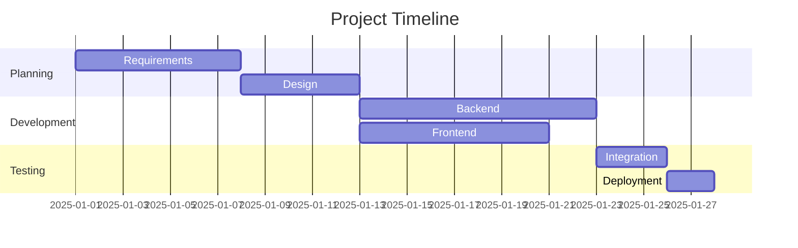
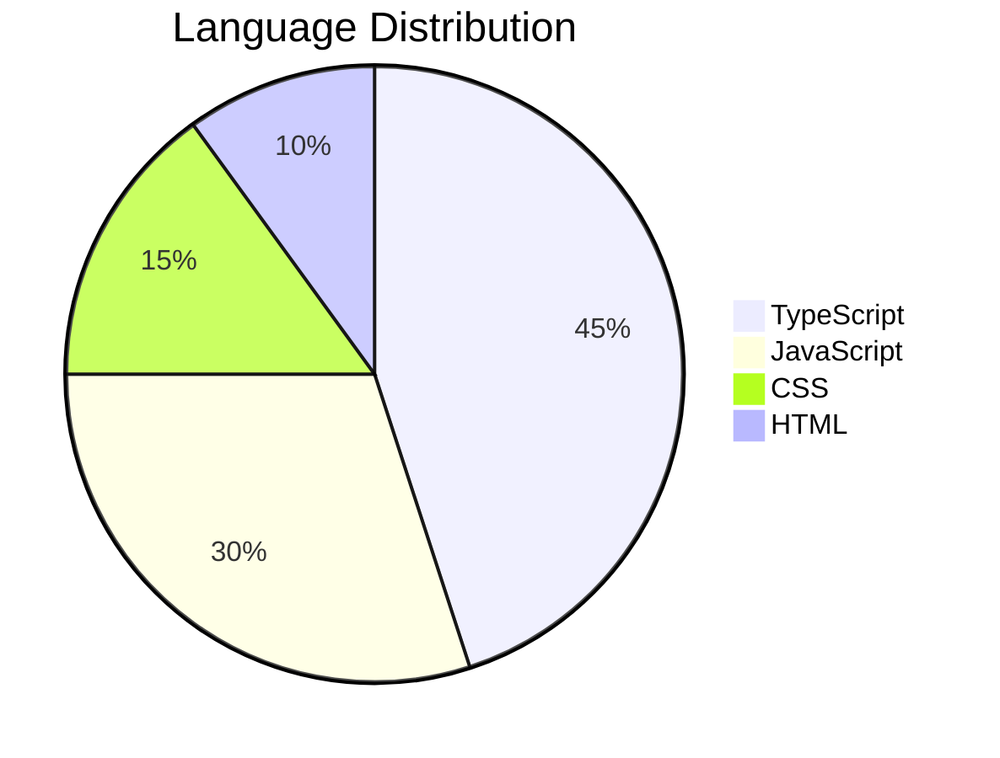

# Syntax Reference

This page showcases all supported markdown syntax including standard Obsidian features and Obsidian:P extensions.

## Basic Markdown

### Headings

```markdown
# Heading 1
## Heading 2
### Heading 3
#### Heading 4
##### Heading 5
###### Heading 6
```

### Text Formatting

**Bold text** using `**bold**` or `__bold__`

*Italic text* using `*italic*` or `_italic_`

***Bold and italic*** using `***bold italic***`

~~Strikethrough~~ using `~~strikethrough~~`

==Highlighted text== using `==highlight==`

### Lists

Unordered list:
- Item 1
- Item 2
  - Nested item
  - Another nested item
- Item 3

Ordered list:
1. First item
2. Second item
3. Third item
   1. Nested item
   2. Another nested item

Task list:
- [x] Completed task
- [ ] Incomplete task
- [ ] Another task

### Links

External link: [Obsidian](https://obsidian.md)

Internal link: [[Home]]

Link with custom text: [[Home|Back to Home]]

Link with heading: [[Home#Overview]]

### Blockquotes

> This is a blockquote.
> It can span multiple lines.
>
> And have multiple paragraphs.

### Code

Inline code: `const x = 42;`

Code block:
```javascript
function hello(name) {
  console.log(`Hello, ${name}!`);
}
```

### Tables

| Column 1 | Column 2 | Column 3 |
|----------|----------|----------|
| Row 1    | Data     | More     |
| Row 2    | Data     | More     |

### Horizontal Rule

---

## Obsidian-Specific Syntax

### Wiki-Links

Basic link: [[Installation]]

Link with custom text: [[Installation|Get Started]]

Link to heading: [[Home#Key Features]]

Link with folder path: [[Getting-Started/Installation]]

### Embeds

Embed an image:
```markdown
![[image.png]]
```

Embed a note:
```markdown
![[Note Name]]
```

Embed with custom display:
```markdown
![[Note Name|Custom Title]]
```

### Tags

Inline tags: #obsidian #markdown #documentation

Nested tags: #project/active #category/documentation

### Frontmatter

```yaml
---
title: My Note
tags:
  - example
  - documentation
date: 2025-10-24
author: Your Name
---
```

### Callouts

> [!note]
> This is a note callout. Use it for general information.

> [!tip]
> This is a tip callout. Use it for helpful advice.

> [!warning]
> This is a warning callout. Use it for important warnings.

> [!important]
> This is an important callout. Use it for critical information.

> [!info]
> This is an info callout with a custom title.

## Math Rendering (KaTeX)

### Inline Math

Einstein's famous equation: $E = mc^2$

Pythagorean theorem: $a^2 + b^2 = c^2$

### Display Math

$$
\int_{-\infty}^{\infty} e^{-x^2} dx = \sqrt{\pi}
$$

$$
\begin{aligned}
\nabla \times \vec{\mathbf{B}} -\, \frac1c\, \frac{\partial\vec{\mathbf{E}}}{\partial t} &= \frac{4\pi}{c}\vec{\mathbf{j}} \\
\nabla \cdot \vec{\mathbf{E}} &= 4 \pi \rho \\
\nabla \times \vec{\mathbf{E}}\, +\, \frac1c\, \frac{\partial\vec{\mathbf{B}}}{\partial t} &= \vec{\mathbf{0}} \\
\nabla \cdot \vec{\mathbf{B}} &= 0
\end{aligned}
$$

### Matrix

$$
\begin{bmatrix}
1 & 2 & 3 \\
4 & 5 & 6 \\
7 & 8 & 9
\end{bmatrix}
$$

### Complex Equations

Quadratic formula:
$$
x = \frac{-b \pm \sqrt{b^2 - 4ac}}{2a}
$$

Summation:
$$
\sum_{n=1}^{\infty} \frac{1}{n^2} = \frac{\pi^2}{6}
$$

## Mermaid Diagrams

### Flow Chart



### Sequence Diagram



### Class Diagram



### State Diagram



### Gantt Chart



### Pie Chart



## ABC Music Notation

### Simple Scale

```abc
X:1
T:C Major Scale
M:4/4
L:1/4
K:C
CDEFGAB
```

### Melody Example

```abc
X:1
T:Twinkle Twinkle Little Star
M:4/4
L:1/4
K:C
CC GG | AA G2 | FF EE | DD C2 |
GG FF | EE D2 | GG FF | EE D2 |
CC GG | AA G2 | FF EE | DD C2 |
```

### Multiple Voices

```abc
X:1
T:Two Part Harmony
M:4/4
L:1/8
K:C
V:1
CDEF GABc | c2 B2 A2 G2 |
V:2
C,2 D,2 E,2 F,2 | G,2 G,2 C,2 C,2 |
```

## Code Highlighting (Shiki)

### TypeScript

```typescript
interface User {
  id: number;
  name: string;
  email: string;
}

class UserManager {
  private users: Map<number, User> = new Map();

  addUser(user: User): void {
    this.users.set(user.id, user);
  }

  getUser(id: number): User | undefined {
    return this.users.get(id);
  }
}
```

### Python

```python
def fibonacci(n):
    """Calculate the nth Fibonacci number."""
    if n <= 1:
        return n
    return fibonacci(n-1) + fibonacci(n-2)

# List comprehension
squares = [x**2 for x in range(10)]
print(squares)
```

### JavaScript

```javascript
// Arrow functions
const greet = (name) => `Hello, ${name}!`;

// Async/await
async function fetchData(url) {
  try {
    const response = await fetch(url);
    const data = await response.json();
    return data;
  } catch (error) {
    console.error('Error:', error);
  }
}
```

### JSON

```json
{
  "name": "obsidianp",
  "version": "0.0.1",
  "description": "Static site generator for Obsidian vaults",
  "scripts": {
    "build": "tsc",
    "start": "node dist/cli.js"
  }
}
```

### YAML

```yaml
name: Deploy to GitHub Pages
on:
  push:
    branches: [main]
jobs:
  build:
    runs-on: ubuntu-latest
    steps:
      - uses: actions/checkout@v4
      - name: Build
        run: npm run build
```

### CSS

```css
:root {
  --primary-color: #7c3aed;
  --font-family: "Mona Sans", sans-serif;
}

.container {
  display: flex;
  flex-direction: column;
  gap: 1rem;
  padding: 2rem;
  background: var(--primary-color);
}
```

### SQL

```sql
SELECT u.name, COUNT(o.id) as order_count
FROM users u
LEFT JOIN orders o ON u.id = o.user_id
WHERE u.created_at > '2025-01-01'
GROUP BY u.id, u.name
HAVING COUNT(o.id) > 5
ORDER BY order_count DESC;
```

### Bash

```bash
#!/bin/bash

# Generate static site
obsidianp generate ./vault ./dist

# Deploy to server
rsync -avz --delete ./dist/ user@server:/var/www/site/

echo "Deployment complete!"
```

## Obsidian Databases

Obsidian:P supports Obsidian-style databases using `.base` files for organizing and displaying notes.

### Inline Base Syntax

````markdown
```base
title: Project Tasks
views:
  - type: cards
    name: Card View
  - type: table
    name: Table View
filters:
  file.tag: project
properties:
  status:
    type: select
    options:
      - Todo
      - In Progress
      - Done
```
````

### Embedding Bases

Embed a base file:
```markdown
![[Projects.base]]
```

Embed with specific view:
```markdown
![[Projects.base#Table View]]
```

---

## Special Features

### Properties Panel

Frontmatter is automatically rendered as a collapsible properties panel. Click the chevron to expand/collapse.

### Backlinks

Notes automatically show which other notes link to them in a backlinks section.

### Local Graph

Each note includes a mini graph view showing its connections to other notes.

### Search

Full-text search across all notes with tag filtering.

### Theme Toggle

Automatic light/dark theme with smooth transitions.

---

This syntax reference demonstrates all the rendering capabilities of Obsidian:P. For more information, see:
- [[Getting-Started/Configuration|Configuration]]
- [[Features/Interactive Graph Views|Graph Views]]
- [[Features/Search System|Search]]
